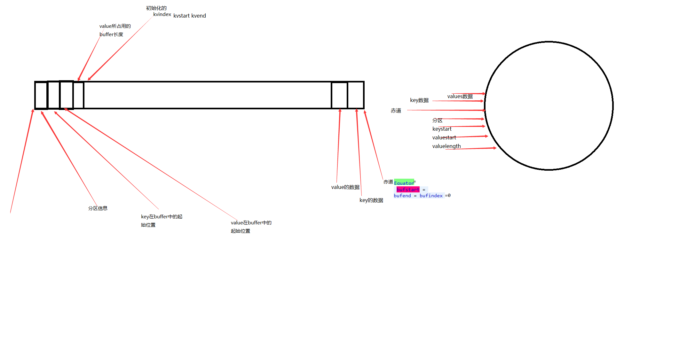
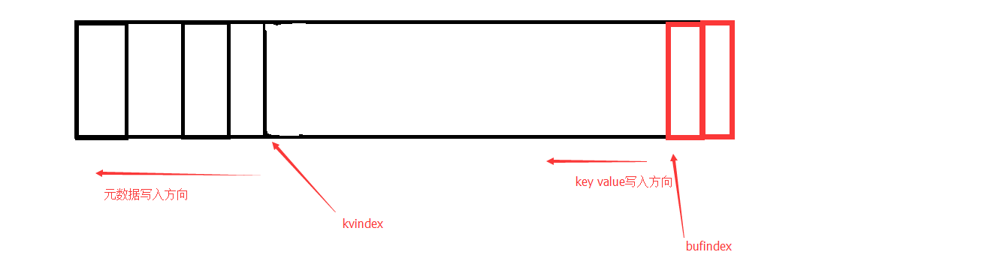

### 一.初始化mr环形缓冲区(maptask.MapOutputBuffer):

hadoopd的环形缓冲区其实只是一个简单的buffer(),下面我们来看一下MapOutputBuffer的init方法:

```java
private IntBuffer kvmeta; 			// 存储元数据信息 **注意这是一个intbuffer 存储int  至于元数据为什么都是int,下面会有答案**
byte[] kvbuffer;        			//环形缓冲区的数组

final int sortmb = job.getInt(JobContext.IO_SORT_MB, 100);//首先通过配置文件得到了环形缓冲区的大小,默认情况下是100M

int maxMemUsage = sortmb << 20; 	//通过位运算把100m转化成对应的字节
kvbuffer = new byte[maxMemUsage]; 	//创建一个buffer
bufvoid = kvbuffer.length;
kvmeta = ByteBuffer.wrap(kvbuffer)   //通过伪装得到一个元数据数组 
     .order(ByteOrder.nativeOrder())      //这个数组是int  所以总大小/4
     .asIntBuffer();                      //100M位例值为26214400
setEquator(0);                            //设置初始的赤道的位置为0(稍后解释赤道)
bufstart = bufend = bufindex = equator;   //初始化buffer参数
kvstart = kvend = kvindex;                //初始化meta参数   

private void setEquator(int pos) {
final int aligned = pos - (pos % METASIZE);  //在这里pos为0, 所以aligned=0
kvindex =((aligned - METASIZE + kvbuffer.length) % kvbuffer.length) / 4;
}  //26214396
```

以上,就是整个环形缓冲区的初始化过程,可以简单理解为通过读取配置文件(默认100M)获得一个100M大小的byte数组,然后这个 数组再通过包装,包装成了一个intbuffer 此时,kvbuffer和kvmeta在内存中的指向都是同一个数组,即100m大小的byte数组,
通过kvindex(26214396)的值和kvmate(26214400)也可以看到,包装之后的kvindex是指向数组的末尾,由此我们也可以大概知道,我们的元数据信息是从末尾到头的顺序写入

###二.mr环形缓冲区的结构:

这是环形缓冲区的结构示意图:
1.整个环形缓冲区以赤道为起点,开始向两边读写数据
2.之所以元数据信息全部都是整数,是因为 他只存储分区信息(整数)和kvbuffer在数组中的位置,每个元素局信息占16字节4X4
4.环形缓冲区的数据写入(不考虑spill进行)maptask.MapOutputBuffer.collect();
1.根据bufferindex找到key的长度然后序列化之后进行写入

```java
int keystart = bufindex;
//序列化之后写入buffer,写入后获得新的bufindex
keySerializer.serialize(key);
//此时会判断是否已经连续写完,如果在内存满的时候进行写入,此时有可能空间不足,导致数据写入一半,为了保证数据完全写入此时判断并处理(之后会提到详细过程)
if (bufindex < keystart) {
// wrapped the key; must make contiguous
bb.shiftBufferedKey();
keystart = 0;
}
写入value的原理相同
final int valstart = bufindex;
valSerializer.serialize(value);
```

2.元数据的写入
1.元数据的写入比较简单,每次写入都写入一个int型,但是我们要记住,写入的时候的位置,因为我们是从后往前写

kvmeta.put(kvindex + PARTITION, partition);
kvmeta.put(kvindex + KEYSTART, keystart);
kvmeta.put(kvindex + VALSTART, valstart);
kvmeta.put(kvindex + VALLEN, distanceTo(valstart, valend));
// advance kvindex 改变每次index的值 每次4个位置!
kvindex = (kvindex - NMETA + kvmeta.capacity()) % kvmeta.capacity();
四:当写入的buffer的大小达到80% 满足溢写条件的时候,开始溢写
